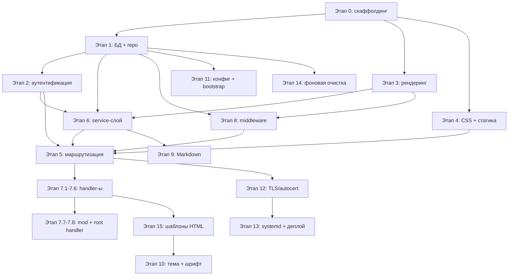

# Порядок имплементации teblorum

**Рекомендуемая последовательность шагов с учётом зависимостей и тестов.**

---

| № | Этап | Зависит от | Оценка сложности | Тесты | Готов |
|---|------|-----------|-----------------|-------|:-----:|
| 1 | **Этап 0** — скаффолдинг | — | малая | `model/` | ✅ |
| 2 | **Этап 1** — БД + репозитории | 0 | средняя | `repo/` | ✅ |
| 3 | **Этап 3** — рендеринг шаблонов | 0 | средняя | `render/` | ✅ |
| 4 | **Этап 4** — CSS + статика | 0 | малая | — | ✅ |
| 5 | **Этап 2** — аутентификация | 1 | средняя | `auth/` + `middleware/auth` | ✅ |
| 6 | **Этап 6** — service-слой | 1, 2 | средняя | `service/` | ✅ |
| 7 | **Этап 8** — middleware | 2 | средняя | `middleware/` | ✅ |
| 8 | **Этап 5** — маршрутизация | 2, 3, 4, 7, 8 | малая | — | ✅ |
| 9 | **Этап 7.1-7.6** — handler-ы | 5, 6, 8 | большая | `handler/` | ✅ |
| 10 | **Этап 9** — Markdown | 6 | малая | `markdown/` | ✅ |
| 11 | **Этап 7.7-7.8** — moderation + root handler | 7.1-7.6, 6.5, 6.6 | средняя | `handler/` | ✅ |
| 12 | **Этап 15** — шаблоны (HTML) | 3, 7 | большая | golden files | ✅ |
| 13 | **Этап 10** — тема + шрифт | 3, 15 | малая | — | ✅ |
| 14 | **Этап 11** — конфиг + bootstrap root | 1, 2 | малая | `config/` | ✅ |
| 15 | **Этап 14** — фоновая очистка | 1 | малая | — | ✅ |
| 16 | **Этап 12** — TLS/autocert | 5 | средняя | — | ✅ |
| 17 | **Этап 13** — systemd + деплой | 11 | малая | — | ✅ |

---

## Граф зависимостей (визуально)



---

## Правило перехода

```bash
# После завершения каждого этапа:
go vet ./... && go test ./... -count=1 -race

# Если OK → commit → следующий этап.
# Если FAIL → стоп, исправление, повтор.
```